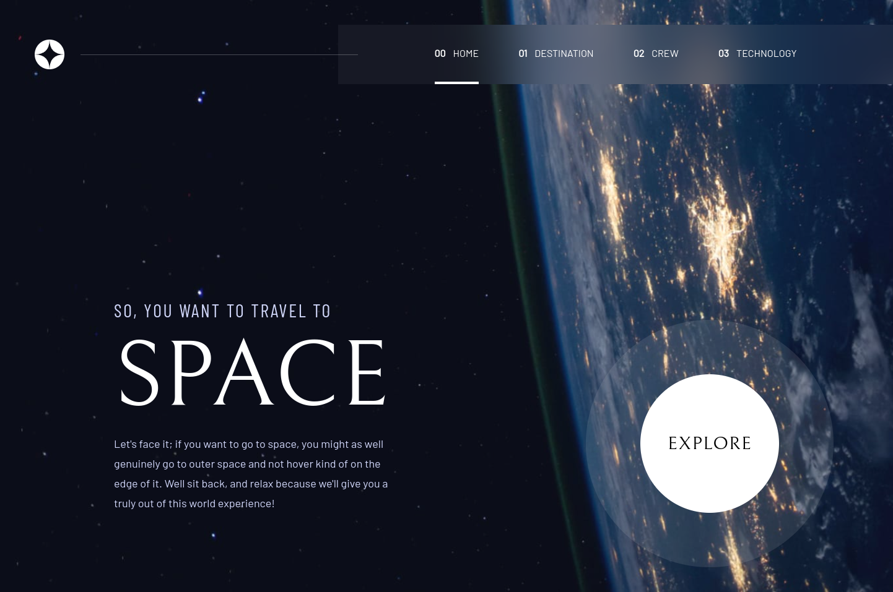

# Frontend Mentor - Space tourism website solution

This is a solution to the [Space tourism website challenge on Frontend Mentor](https://www.frontendmentor.io/challenges/space-tourism-multipage-website-gRWj1URZ3). Frontend Mentor challenges help you improve your coding skills by building realistic projects.

## Table of contents

- [Frontend Mentor - Space tourism website solution](#frontend-mentor---space-tourism-website-solution)
  - [Table of contents](#table-of-contents)
  - [Overview](#overview)
    - [The challenge](#the-challenge)
    - [Screenshot](#screenshot)
    - [Links](#links)
  - [My process](#my-process)
    - [Built with](#built-with)
    - [What I learned](#what-i-learned)
    - [Continued development](#continued-development)
    - [Useful resources](#useful-resources)
  - [Author](#author)
  - [Acknowledgments](#acknowledgments)

## Overview

### The challenge

Users should be able to:

- View the optimal layout for each of the website's pages depending on their device's screen size
- See hover states for all interactive elements on the page
- View each page and be able to toggle between the tabs to see new information

### Screenshot

.png)
.png)
.png)

### Links

- Solution URL: [GitHub](https://github.com/jaimetrovoada/space-travel)
- Live Site URL: [Live](https://space-travel-ten.vercel.app/)

## My process

### Built with

- [Next.js](https://nextjs.org/) - React framework
- [TailwindCSS](https://tailwindcss.com/) - For styles

### What I learned

### Continued development

### Useful resources

## Author

- Website - [Jaime Trovoada](https://jaimetrovoada.vercel.app/)
- [Frontend Mentor](https://www.frontendmentor.io/profile/jaimetrovoada)
- [GitHub](https://github.com/jaimetrovoada)

## Acknowledgments
